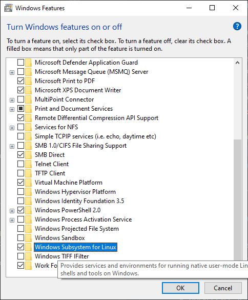

# Docker commands and overview <!-- omit in toc -->

## Contents <!-- omit in toc -->

- [1. Whats is docker anb containers?](#1-whats-is-docker-anb-containers)
  - [1.1. Docker](#11-docker)
    - [1.1.1. Advantages of Docker](#111-advantages-of-docker)
  - [1.2. Container](#12-container)
- [2. Instalation in Windows 10](#2-instalation-in-windows-10)
- [3. Docker commands](#3-docker-commands)
- [4. Dockerfile structure](#4-dockerfile-structure)
- [5. Docker compose](#5-docker-compose)
  - [5.1. Commands Docker Compose](#51-commands-docker-compose)
  - [5.2. Docker Compose template](#52-docker-compose-template)
- [6. Access Docker using REST API or Expose docker remotely](#6-access-docker-using-rest-api-or-expose-docker-remotely)
- [7. Docker images](#7-docker-images)
  - [7.1. RabbitMQ (http://localhost:15672/)](#71-rabbitmq-httplocalhost15672)
  - [7.2. MsSql (localhost,1445)](#72-mssql-localhost1445)
  - [7.3. Jenkins](#73-jenkins)
  - [7.4. Gitlab](#74-gitlab)
  - [7.5. MongoDb](#75-mongodb)
    - [7.5.1. Web client MongoDb](#751-web-client-mongodb)
  - [7.6. Redis](#76-redis)
  - [7.7. PostgreSql](#77-postgresql)
- [8. Grafana](#8-grafana)
- [9. Graphite / Statds](#9-graphite--statds)
- [10. Extras](#10-extras)

# 1. Whats is docker anb containers?

## 1.1. Docker

- Docker is an open platform for developing, shipping, and running applications. Docker provides to separate your applications from your infrastructure so you can deliver software quickly.

### 1.1.1. Advantages of Docker

- Methodologies for shipping, testing, and deploying code quickly, you can significantly reduce the delay between writing code and running it in production.
- Docker provides for automating the deployment of applications as portable, self-sufficient containers that can run on the cloud or on-premises.
- Docker containers can run anywhere, in your local computer to the cloud.
- Docker image containers can run natively on Linux and Windows.

## 1.2. Container

- A container is a standard unit of software that packages up code and all its dependencies so, the application runs quickly and reliably from one computing environment to another.
- A Docker container image is a lightweight, standalone, executable package of software that includes everything needed to run an application.

# 2. Instalation in Windows 10

- Enable WSL in Windows 10
  - 
- Update wsl to wsl2
  - wsl --update

# 3. Docker commands

- All informations about docker in the machine
  - docker info
- Show the Docker version information
  - docker --version
- Create container by image
  - docker create --name `<container_name>` `<image_name>`
- Show running containers (Process status)
  - docker ps
  - docker ps -a # Show all
  - docker container ls -a
  - docker container ps -a
- List all images in local repository
  - docker images
- Pull (download) an image or a repository from a registry
  - docker pull `<image_name>:<version>` or `<tag>` # Example docker pull hello-world:latest
- Rum a command to start a container
  - docker start `<container_name>`
- Rum a command to stop a container
  - docker stop `<container_name>`
- Create and run the container, this command eliminates the need to run `docker create` and then `docker start`
  - docker run `<image_name>` # Example docker run hello-world
  - docker run -d `<image_name>` # -d Detach, run container in background and print container ID
  - docker run -d -p `<external_port:internal_docker_port>` `<image_name>`
  - docker run -it --rm `<image_name>` # Run and delete the container when the container stops
- Remove image
  - docker image rm `<image_name>` or `<image_id>` # Example docker image rm hello-world:latest
- Remove container
  - docker container rm `<container_name>` or `<container_id>`
- Docker attach commands to start the container and peek at the output stream
  - docker attach --sig-proxy=false core-counter `<container_name>`
- Fetch the logs of a container
  - docker logs -f `<image_name>` # Log live
- Run a command in a running container
  - docker exec -it `<container_name>` bash # -it --interactive and --tty
  - docker exec -it -u root `<container_name>` bash # With user root
- Copy files/folders between a container and the local filesystem
  - docker cp `<file_name>` `<container_name>`:`<path>`/`<file_name>` # Example: docker cp script.sh myContainer:/tmp/script.sh
- Build Dockerfile
  - docker build .

# 4. Dockerfile structure

- `FROM` # Fully qualified Docker container image name
- `COPY` # Copy the specified folder on your computer to a folder in the container
- `WORKDIR` # Changes the current directory inside of the container to App
- `ENTRYPOINT` # Tells Docker to configure the container to run as an executable

# 5. Docker compose

## 5.1. Commands Docker Compose

- All informations about docker compose in the machine
  - docker-compose version
- Create/Recreate and start containers, use docker-compose.yml
  - docker-compose up -d
- Build or rebuild services
  - docker-compose build
- Starts existing containers for a service.
  - docker-compose start
- Stop all containers
  - docker-compose stop
- Docker
  - compose-build
- Remove all containers and images
  ```
  docker-compose down
  docker rm -f $(docker ps -a -q)
  docker volume rm $(docker volume ls -q)
  docker rmi -f $(docker images -a -q)
  ```

## 5.2. Docker Compose template

```
version: '3'
services:
  my_service:
    container_name: CONTAINER_NAME
    image: IMAGE_NAME
    ports:
      - "8080:8080"
    volumes:
      - "$PWD/HOME:/VAR/PATH_HERE"
    networks:
      - net
networks:
  net:
```

# 6. Access Docker using REST API or Expose docker remotely

1. ps -ef | grep docker
2. sudo nano /lib/systemd/system/docker.service
3. Replace line ExecStart=\*\*\* to ExecStart=/usr/bin/dockerd -H fd:// -H=tcp://0.0.0.0:2375
4. sudo systemctl daemon-reload
5. sudo service docker restart
6. Test with url http://address:2375/images/json or http://address:2375/containers/json

# 7. Docker images

## 7.1. RabbitMQ (http://localhost:15672/)

- docker pull rabbitmq:3-management
- docker run -d -p 15672:15672 -p 5672:5672 --name rabbit_dev rabbitmq:3-management
- docker run -d -p 5672:5672 -p 15672:15672 --name rabbitmq_dev rabbitmq:3.9-management
- Default user and password: guest/guest

## 7.2. MsSql (localhost,1445)

- docker pull mcr.microsoft.com/mssql/server:2019-latest
- docker run -d -e "ACCEPT_EULA=Y" -e "SA_PASSWORD=yourStrong(!)Password" --name ordermssql -p 1445:1433 mcr.microsoft.com/mssql/server:2019-latest

## 7.3. Jenkins

- docker pull jenkins/jenkins
- docker run -p 8080:8080 jenkins/jenkins -- name jenkins_dev

## 7.4. Gitlab

- sudo docker exec -it gitlab_dev grep 'Password:' /etc/gitlab/initial_root_password
- sudo gitlab-rake "gitlab:password:reset[root]"

## 7.5. MongoDb

- docker pull mongo
- docker run -d -p 27017:27017 --name mongo_dev mongo
- docker exec -it mongo_dev bash

### 7.5.1. Web client MongoDb

- docker pull mongoclient/mongoclient

## 7.6. Redis

- docker pull redis
- docker run -d -p 6379:6379 --name redis_dev redis

## 7.7. PostgreSql

- docker run --name postgres_dev -p 5432:5432 -e POSTGRES_PASSWORD=mysecretpassword -d postgres

# 8. Grafana

- docker run -d --name=grafana -p 3000:3000 grafana/grafana

# 9. Graphite / Statds

- docker run -d --name graphite --restart=always -p 80:80 -p 2003-2004:2003-2004 -p 2023-2024:2023-2024 -p 8125:8125/udp -p 8126:8126 graphiteapp/graphite-statsd

# 10. Extras

- Specific command to dotnet applications
  - docker build -f API\Dockerfile . -t api
